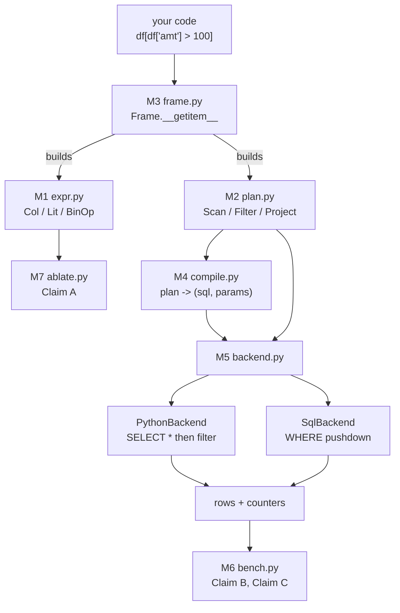

# Projects — the build-first track

Everything else in this repo is a lesson. This directory is not.

A lesson can be consumed. A project cannot — it either runs or it doesn't, and it
either produces the number you predicted or it humiliates you. That asymmetry is
the entire reason this directory exists.

---

## 0. Why a projects track exists at all

The lessons in `tracks/python/` established a claim: **syntax is not magic, it is a
method lookup on the type.** `len(x)` is `type(x).__len__(x)`. `x[k]` is
`type(x).__getitem__(x, k)`. `a + b` is `type(a).__add__(a, b)` with a fallback.

Knowing that sentence is worth approximately nothing.

It becomes worth something the moment you use it to build a thing that *looks like
a language feature but is entirely yours* — and then measure what that costs. Every
serious data tool in Python is exactly this and nothing more:

| Tool | What it really is |
|---|---|
| `pandas` | `__getitem__` overloaded four ways + `__eq__` that returns a Series |
| `PySpark` | `Column.__gt__` builds an expression tree; `DataFrame` builds a logical plan |
| `SQLAlchemy` | `User.name == "x"` returns a `BinaryExpression`, not `True` |
| `Airflow` | `task_a >> task_b` is `__rshift__` wiring a DAG |

You are not learning a Python trivia topic. You are learning the construction
technique behind the four tools you will be interviewed on.

---

## 1. The standard every project here must meet

### 1.1 The research bar

A build is not research because it is hard. It is research when it has three
things, and it is a toy when it is missing any of them:

1. **A claim** — stated precisely enough that it could turn out false.
2. **A measurement** — the specific number that would falsify it.
3. **A surprise** — a result you did not predict. *You must commit the prediction
   in writing, before running.* An unpredicted result is a data point; an
   unpredicted result that contradicts a written prediction is a finding.

If a project finishes and nothing surprised you, either your predictions were
lucky or your experiment was too weak. Both are worth knowing.

### 1.2 The annotation standard

You asked for line-level accountability. Here is the exact format, and it is
non-negotiable for every module in this track. Each module ends with an
annotation block:

| Line / construct | Why it exists | Observable result | What breaks without it |
|---|---|---|---|

Three rules on that fourth column:

- **"What breaks" is never asserted from memory. It is executed.** Module `M7`
  (`ablate.py`) removes each dunder at runtime and records the actual failure.
- The failure is classified into exactly one of three buckets:
  - `LOUD` — raises immediately. The cheapest kind of bug.
  - `QUIET` — returns a wrong answer with no error. **This is the column that
    matters.** These are the bugs that reach production.
  - `NONE` — nothing breaks. Then the line was decoration; delete it.
- A row whose fourth column reads "it would break" without a reproduction is an
  unfinished row.

### 1.3 What is banned here

- No dependency that isn't in the standard library. `sqlite3`, `time`,
  `tracemalloc` and `dataclasses` are enough. Zero `pip install`.
- No code written before its prediction is committed to `DESIGN.md`.
- No copying the reference implementation of `pandas`/`SQLAlchemy` before you have
  produced your own wrong version first. Reading the answer first destroys the
  experiment.

---

## 2. P1 — `minidf`, a lazy query DSL that compiles to SQL

### 2.1 What it does, in plain English

You will write this:

```python
df = Frame("transactions", conn)
result = df[df["amount"] > 100_000][["id", "amount"]]
```

Nothing has run yet. No database was touched. `df["amount"] > 100_000` did **not**
produce `True` or `False` — it produced an *object describing a comparison*. The
second `[...]` did not filter anything — it produced an *object describing a
filter*. `result` is a plan, not data.

Then you write this, and only now does anything execute:

```python
for row in result:
    ...
```

And when it executes, it does not drag a million rows into Python and throw them
away. It turns your plan into:

```sql
SELECT id, amount FROM transactions WHERE (amount > ?)
```

and lets the database throw them away instead.

### 2.2 Why this project and not an easier one

The three-second version: **this is the smallest possible thing that is genuinely
shaped like Spark.**

| Pillar you're hired on | Where this project touches it |
|---|---|
| Spark / PySpark internals | Lazy evaluation, logical plan vs physical plan, `explain()`, predicate pushdown — you will implement all four, not read about them |
| System / data design | The central design question is *where does work happen* — an architecture question, not a syntax question |
| SQL | You will generate SQL from a tree, which forces you to understand SQL's evaluation order rather than pattern-match it |
| DSA | Expression trees, recursive traversal, visitor dispatch. This is a tree algorithm wearing a business suit |

And the reason it is *interesting* rather than merely useful: to make
`df["amount"] > 100` build a tree, you must overload `>` — and once you overload
comparison operators to return non-booleans, **you have quietly broken a contract
that the entire Python standard library assumes.** That break is the research.

---

## 3. The three claims under test

These go in `DESIGN.md` with your predicted numbers before a line is written.

### Claim A — semantic (the interesting one)

> Overloading comparison operators to return an expression tree silently changes
> the meaning of every stdlib facility that assumes `a == b` yields a bool.

`in`, `list.index()`, `assert`, `if`, `sorted()`, `dict` keys, `unittest.assertEqual`,
`max()`, `set()`. Each one gets classified `LOUD` / `QUIET` / `NONE`.

**The finding is the size of the `QUIET` column.** Prediction required.

### Claim B — performance

> Deferring evaluation lets the consumer rewrite the computation before running it.
> Pushing the predicate into the source reduces rows materialized by
> approximately `1 / selectivity`.

At 1,000,000 rows and 0.1% selectivity, the ratio should be near 1000×. Wall time
will **not** improve by 1000× — predict that ratio separately, and be ready to
explain the gap. The gap is the whole lesson about where time actually goes.

### Claim C — divergence (the gem)

> The same logical plan, executed by two correct-looking backends, returns
> different rows.

Insert `NULL` into the amount column. SQL's `WHERE amount > 100` silently drops
NULL rows — three-valued logic. Python's `None > 100` raises `TypeError`. Neither
backend is wrong on its own terms; the *plan* is under-specified. This is a real
class of production bug in every warehouse migration on earth, and you will have
manufactured it deliberately in about forty lines.

---

## 4. Architecture



**The dependency arrows only point one way.** If `expr.py` ever imports from
`plan.py`, or `plan.py` ever learns a word of SQL syntax, the design has collapsed
and the pushdown experiment becomes impossible to run. Layering is not tidiness
here — it is the precondition for the measurement.

---

## 5. Module contracts

Each module below is a contract you implement. "Must not know" is as binding as
"owns" — the ignorance is what makes the layers swappable.

### M1 — `expr.py` : the expression tree

- **Owns:** `Expr` (base), `Col`, `Lit`, `BinOp`, `UnaryOp`, and the helper `col()`.
- **Dunders:** `__gt__ __ge__ __lt__ __le__ __eq__ __ne__ __and__ __or__ __invert__ __repr__ __bool__ __hash__`
- **Must not know:** tables, rows, SQL, databases, execution. **Zero imports from
  this project.** If you need one, the layering is wrong.
- **Done when:**
  - `repr(col("amt") > 100)` prints a readable tree, not `<Expr object at 0x…>`.
  - `bool(col("amt") > 100)` raises `TypeError` whose message tells the caller to
    use `&` and `|`. *This is a deliberate refusal, not an oversight.*
  - You can state what `hash(col("a") == 1)` does and why.

### M2 — `plan.py` : the logical plan

- **Owns:** `Scan(table)`, `Filter(child, predicate)`, `Project(child, columns)`,
  `Limit(child, n)`, and a `__repr__` that renders an indented tree.
- **Must not know:** SQL syntax, Python filtering, the `sqlite3` module.
- **Done when:** `print(plan)` produces something that reads like Spark's
  `explain()` — child nodes indented under parents.

### M3 — `frame.py` : the user-facing surface

- **Owns:** `Frame`, whose `__getitem__` dispatches **on the type of the key**:
  `str` → a column reference, `list[str]` → a projection, `Expr` → a filter.
- **Also owns:** `__iter__` (the *only* thing that triggers execution), `__len__`,
  `__repr__` (shows the plan, never the data).
- **Must not know:** how execution happens. It builds a plan and hands it to a
  backend it was given.
- **Done when:** `df[df["amt"] > 100][["id","amt"]]` returns a `Frame` whose repr
  shows `Project(Filter(Scan))` and **has not opened a cursor**.
- **The trap to notice:** one bracket, four meanings. This is precisely why
  `pandas` indexing is famously confusing. You are about to build that confusion
  on purpose and will understand it permanently.

### M4 — `compile.py` : plan → SQL

- **Owns:** the recursive walk that turns an `Expr` into a SQL fragment and a
  plan into a full statement.
- **Returns `(sql, params)` — never an interpolated string.** Literal values leave
  as `?` placeholders bound by the driver. String-formatting a value into SQL is
  the textbook SQL-injection defect (OWASP A03), and here it is also *wrong on the
  merits*: quoting and type coercion stop being your problem the moment you use
  parameters.
- **Done when:** the example compiles to
  `SELECT id, amt FROM transactions WHERE (amt > ?)` with params `(100,)`.

### M5 — `backend.py` : two executors, one interface

- **Owns:** `PythonBackend` (issue `SELECT *`, build every row, filter in Python)
  and `SqlBackend` (compile the predicate into `WHERE`, let SQLite discard).
- **Both must expose `rows_materialized`** — the count of rows that actually
  crossed into Python. Without this counter there is no Claim B.
- **Done when:** both return identical rows on clean data, and the counters differ
  by orders of magnitude.

### M6 — `bench.py` : the experiment

- Builds a 1,000,000-row SQLite table, runs both backends over the same plan,
  reports `rows_materialized`, wall time, and peak memory via `tracemalloc`.
- Then re-runs it with `NULL`s injected — that run is Claim C.

### M7 — `ablate.py` : the "what breaks" harness

- For each dunder on `Expr`, remove it from the class, re-run a fixed battery of
  operations, and record what happened.
- Output is a table with one row per (dunder, operation) pair and a verdict of
  `LOUD` / `QUIET` / `NONE`.
- This module is what converts "here is why this line exists" from my opinion into
  your evidence.

---

## 6. Build order, with gates

Each step is gated. Do not start `n+1` until `n`'s gate passes — the whole value
of the sequence is that each layer is tested in isolation before anything can hide
a bug in it.

| # | Step | Gate |
|---|---|---|
| 0 | Fill `DESIGN.md` — six design answers + three numeric predictions | Every slot has a committed answer. No blanks, no "not sure" |
| 1 | `expr.py` | `repr()` renders a tree; `bool()` raises with a helpful message |
| 2 | `plan.py` | `print(plan)` renders an indented tree |
| 3 | `frame.py` | Chained indexing builds `Project(Filter(Scan))` with zero DB access |
| 4 | `compile.py` | Correct SQL **and** params tuple; no value ever inside the string |
| 5 | `backend.py` | Both backends agree on clean data |
| 6 | `bench.py` | Claim B measured; predicted vs actual recorded |
| 7 | `ablate.py` | Claim A table produced; `QUIET` rows identified |
| 8 | Inject NULLs | Claim C reproduced; backends now disagree |
| 9 | `FINDINGS.md` | Written *after* the numbers, comparing them to your predictions |

---

## 7. Running it

From `tracks/Projects/p1-lazy-query-dsl/`:

```powershell
python -m minidf.bench      # Claims B and C
python -m minidf.ablate     # Claim A
```

Standard library only. No virtualenv required, no packages to install.

---

## 8. Rules of engagement

- **You design, I interrogate.** I do not hand you a finished module. You propose
  the shape, I attack it with edge cases, and the code you end up with is code you
  argued your way into.
- **Predictions before execution, always.** A result you did not predict teaches
  you nothing about your own model, because you never exposed your model.
- **Every module ships with its annotation table** (§1.2) before we move on. That
  table is the deliverable, as much as the `.py` file is.
- **Struggle is the mechanism, not an obstacle.** If I give you the answer at the
  moment it gets uncomfortable, the session was recreational.

---

## 9. Read these *after*, never before

Once `FINDINGS.md` exists, and not one minute earlier:

- `pandas` — "The truth value of a Series is ambiguous" — you will have derived
  the reason yourself.
- PySpark `Column` and `DataFrame.explain()` — compare their plan output to yours.
- SQLAlchemy Core's `BinaryExpression` — the mature version of your `BinOp`.
- The Catalyst optimizer's predicate-pushdown rule — a production version of the
  rewrite you measured.

Reading them first turns the project into transcription. Reading them after turns
them into confirmation, and you will read them roughly ten times faster.
